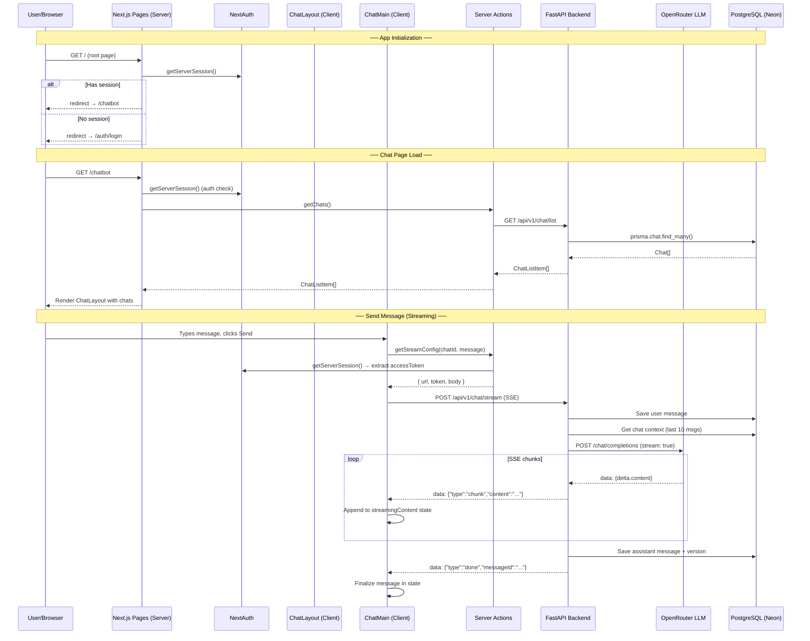
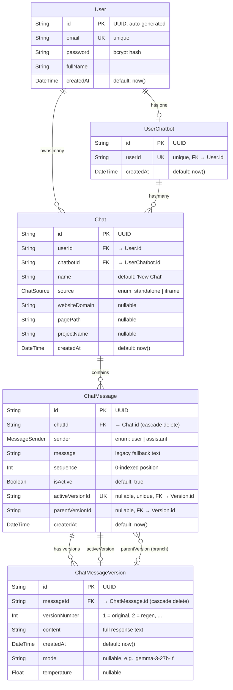
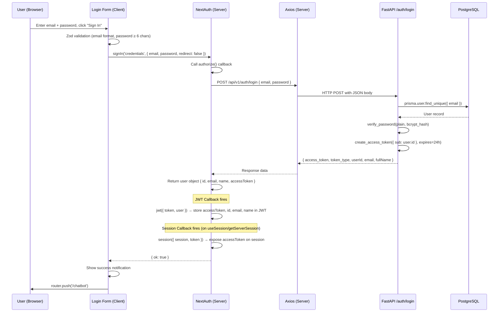
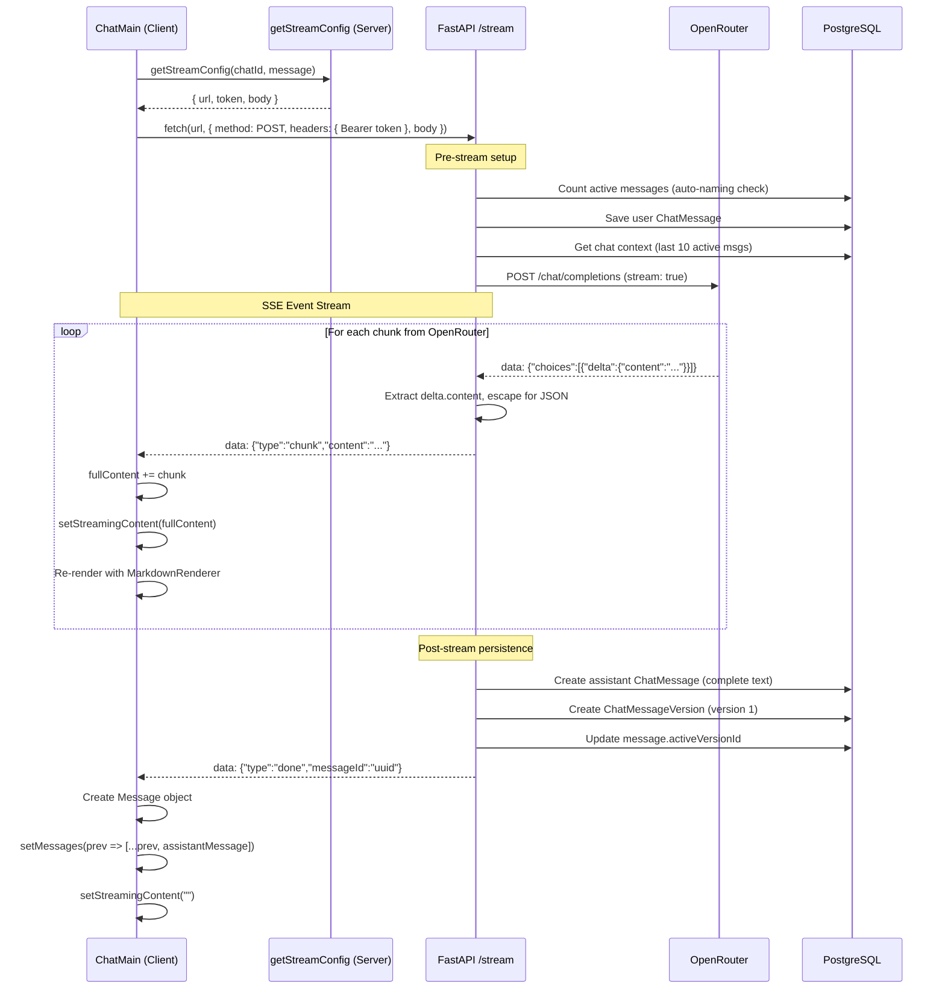
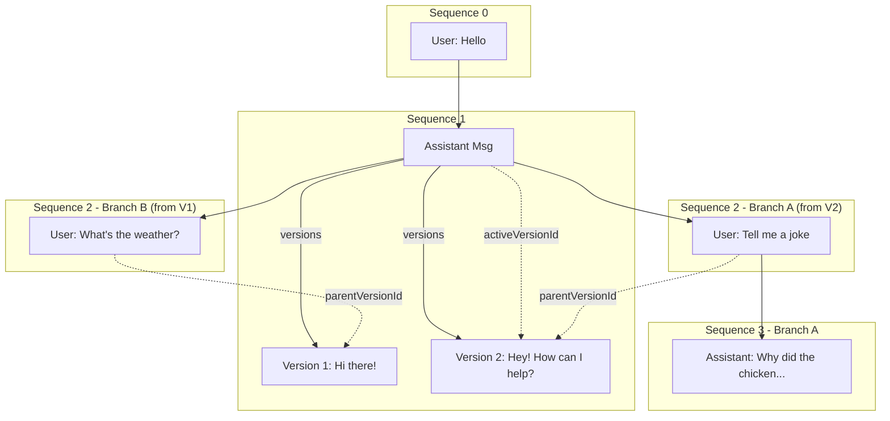
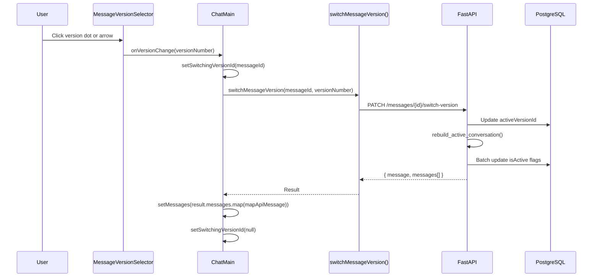

# Chatbot Implementation — Technical Documentation

> **Definitive reference** for the AI Integration Platform chatbot.  
> Last updated: 2026-06-23

---

## Table of Contents

1. [Architecture Overview](#1-architecture-overview)
2. [Complete Data & User Flow](#2-complete-data--user-flow)
3. [Database Schema Deep Dive](#3-database-schema-deep-dive)
4. [Backend Deep Dive](#4-backend-deep-dive)
5. [Frontend Deep Dive](#5-frontend-deep-dive)
6. [Authentication Flow](#6-authentication-flow)
7. [Streaming Architecture](#7-streaming-architecture)
8. [Message Versioning System](#8-message-versioning-system)
9. [Component Interaction Map](#9-component-interaction-map)
10. [API Reference](#10-api-reference)

---

## 1. Architecture Overview

### Monorepo Structure

The project is a **Turborepo + pnpm** monorepo with the following layout:

```
ai-integration-platform/
├── turbo.json                 # Turborepo pipeline config
├── pnpm-workspace.yaml        # pnpm workspace definition
├── package.json               # Root scripts & devDeps (turbo, prisma)
├── apps/
│   ├── web/                   # Next.js 16 frontend (React 19)
│   └── api/                   # FastAPI backend (Python 3.11+)
└── packages/                  # Shared packages (future use)
```

**`pnpm-workspace.yaml`** declares workspace packages:

```yaml
packages:
  - 'apps/*'
  - 'packages/*'
```

**`turbo.json`** defines the task pipeline:

```json
{
  "tasks": {
    "dev":   { "cache": false, "persistent": true },
    "build": { "dependsOn": ["^build"], "outputs": [".next/**", "dist/**"] },
    "lint":  {}
  }
}
```

Root scripts allow running both apps simultaneously:

```json
{
  "dev:web": "pnpm --filter web dev",
  "dev:api": "pnpm --filter api dev",
  "dev":     "turbo run dev --parallel"
}
```

### Tech Stack

| Layer        | Technology                                              |
| ------------ | ------------------------------------------------------- |
| **Frontend** | Next.js 16.1.1, React 19.2.3, TypeScript 5             |
| **Styling**  | Tailwind CSS 4, Mantine 8.3.12, Radix UI primitives    |
| **Auth**     | NextAuth 4.24.13 (Credentials provider, JWT strategy)   |
| **Backend**  | FastAPI 0.128, Uvicorn 0.40, Python 3.11+               |
| **ORM**      | Prisma Client Python 0.15 (prisma-client-py)            |
| **Database** | PostgreSQL (Neon serverless)                             |
| **LLM**      | OpenRouter API (default: `google/gemma-4-31b-it:free`)  |
| **Package**  | pnpm 10.17.1, Poetry (API), Turborepo 2.7.2             |
| **Forms**    | React Hook Form 7.71 + Zod 4.3.5                        |
| **Markdown** | react-markdown 10.1 + remark-gfm 4.0.1                  |

---

## 2. Complete Data & User Flow

### High-Level Sequence



### Detailed Flow — Sending a Message

1. **User types** in the `<input>` inside `ChatMain` and presses Enter or clicks Send
2. **Guard check**: `if (!inputValue.trim() || !chatId || isLoading) return`
3. **Optimistic update**: A temporary user message is appended to `messages` state
4. **Server action call**: `getStreamConfig(chatId, message)` runs on the server to securely obtain the FastAPI URL, JWT access token, and request body
5. **Client-side fetch**: `ChatMain` makes a direct `fetch()` to FastAPI's `/api/v1/chat/stream` with the bearer token
6. **Backend processing**:
   - Validates chat ownership
   - Auto-names chat if first message (truncated to 40 chars)
   - Saves user message to DB with `parentVersionId` linking to the last assistant's active version
   - Fetches last 10 active messages as LLM context
   - Streams response from OpenRouter via `process_chat_request_stream()`
7. **SSE streaming**: Backend yields `data: {"type":"chunk","content":"..."}` events
8. **Frontend parsing**: `ReadableStream` reader → `TextDecoder` → split by `\n` → parse `data: ` prefix → JSON parse → accumulate `fullContent`
9. **State updates**: `setStreamingContent(fullContent)` on each chunk, triggering re-render with `MarkdownRenderer`
10. **Completion**: Backend saves complete assistant message + version to DB, yields `data: {"type":"done","messageId":"..."}`
11. **Finalization**: Frontend creates final `Message` object, adds to `messages` array, clears `streamingContent`

---

## 3. Database Schema Deep Dive

### Entity-Relationship Diagram



### Models Detail

#### `User`
The root identity model. Every user gets exactly one `UserChatbot` created during registration (transactional).

| Field      | Type     | Constraints                |
| ---------- | -------- | -------------------------- |
| `id`       | String   | `@id @default(uuid())`    |
| `email`    | String   | `@unique`                  |
| `password` | String   | bcrypt hash                |
| `fullName` | String   |                            |
| `createdAt`| DateTime | `@default(now())`          |

#### `UserChatbot`
A 1:1 extension of `User` that acts as the chatbot instance owner. Auto-created on registration.

| Field      | Type     | Constraints                        |
| ---------- | -------- | ---------------------------------- |
| `id`       | String   | `@id @default(uuid())`            |
| `userId`   | String   | `@unique`, FK → `User.id`         |
| `createdAt`| DateTime | `@default(now())`                  |

#### `Chat`
A conversation session. Supports `standalone` and `iframe` sources for future embedded widget use.

| Field           | Type       | Constraints                     |
| --------------- | ---------- | ------------------------------- |
| `id`            | String     | `@id @default(uuid())`         |
| `userId`        | String     | FK → `User.id`                  |
| `chatbotId`     | String     | FK → `UserChatbot.id`           |
| `name`          | String     | `@default("New Chat")`          |
| `source`        | ChatSource | Enum                             |
| `websiteDomain` | String?    | For iframe source                |
| `pagePath`      | String?    | For iframe source                |
| `projectName`   | String?    | For iframe source                |
| `createdAt`     | DateTime   | `@default(now())`               |

#### `ChatMessage`
A single message in a conversation. The `sequence` field provides a stable ordering. `isActive` determines visibility in the current conversation branch.

| Field             | Type           | Constraints                               |
| ----------------- | -------------- | ----------------------------------------- |
| `id`              | String         | `@id @default(uuid())`                   |
| `chatId`          | String         | FK → `Chat.id`, cascade delete            |
| `sender`          | MessageSender  | Enum: `user` \| `assistant`               |
| `message`         | String         | Legacy fallback content                    |
| `sequence`        | Int            | 0-indexed, stable position                 |
| `isActive`        | Boolean        | `@default(true)`, visibility flag          |
| `activeVersionId` | String?        | `@unique`, FK → `ChatMessageVersion.id`   |
| `parentVersionId` | String?        | FK → `ChatMessageVersion.id` (branching)   |
| `createdAt`       | DateTime       | `@default(now())`                          |

**Indexes:**
- `@@index([chatId, sequence])` — Fast ordered message retrieval
- `@@index([chatId, isActive])` — Fast active message filtering
- `@@index([parentVersionId])` — Fast branch lookups

#### `ChatMessageVersion`
Stores individual response versions for assistant messages. Enables regeneration and version browsing.

| Field           | Type     | Constraints                                    |
| --------------- | -------- | ---------------------------------------------- |
| `id`            | String   | `@id @default(uuid())`                        |
| `messageId`     | String   | FK → `ChatMessage.id`, cascade delete          |
| `versionNumber` | Int      | 1 = original, 2 = first regen, etc.            |
| `content`       | String   | Full response text                              |
| `createdAt`     | DateTime | `@default(now())`                              |
| `model`         | String?  | LLM model name                                  |
| `temperature`   | Float?   | Generation temperature                           |

**Unique constraint:** `@@unique([messageId, versionNumber])`  
**Index:** `@@index([messageId])`

### Enums

| Enum            | Values                    | Used By        |
| --------------- | ------------------------- | -------------- |
| `ChatSource`    | `standalone`, `iframe`    | `Chat.source`  |
| `MessageSender` | `user`, `assistant`       | `ChatMessage.sender` |

---

## 4. Backend Deep Dive

The API lives at `apps/api/` and uses **FastAPI** with **Prisma Client Python** for ORM.

### `app/main.py` — Application Entry Point

```python
from contextlib import asynccontextmanager
from fastapi import FastAPI
from app.db import prisma
from app.api.v1.api import api_router

@asynccontextmanager
async def lifespan(app: FastAPI):
    await prisma.connect()
    yield
    await prisma.disconnect()

app = FastAPI(title="AI Integration Platform API", lifespan=lifespan)

# CORS — allows http://localhost:3000
app.add_middleware(CORSMiddleware, allow_origins=["http://localhost:3000"], ...)

# Mount all routes under /api/v1
app.include_router(api_router, prefix="/api/v1")

@app.get("/health")
def health_check():
    return {"status": "Welcome"}
```

**Key details:**
- Uses the **lifespan** context manager pattern to manage Prisma DB connections
- CORS is configured for the frontend dev server (`localhost:3000`)
- All API routes are prefixed with `/api/v1`

### `app/db.py` — Prisma Singleton

```python
from prisma import Prisma
prisma = Prisma()
```

A module-level singleton. Connected in the lifespan handler, used across all services.

### `app/core/config.py` — Configuration

```python
class Settings(BaseSettings):
    DATABASE_URL: str
    SECRET_KEY: str = "your-secret-key-change-me-in-production"
    ALGORITHM: str = "HS256"
    ACCESS_TOKEN_EXPIRE_MINUTES: int = 1440  # 24 hours
    OPENROUTER_API_KEY: str
    OPENROUTER_MODEL: str = "google/gemma-4-31b-it:free"

    model_config = SettingsConfigDict(env_file=".env", extra="ignore")

settings = Settings()
```

| Variable                      | Default                          | Purpose                          |
| ----------------------------- | -------------------------------- | -------------------------------- |
| `DATABASE_URL`                | *required*                       | Neon PostgreSQL connection string |
| `SECRET_KEY`                  | `"your-secret-key..."`           | JWT signing key                   |
| `ALGORITHM`                   | `"HS256"`                        | JWT algorithm                     |
| `ACCESS_TOKEN_EXPIRE_MINUTES` | `1440` (24h)                     | Token TTL                         |
| `OPENROUTER_API_KEY`          | *required*                       | OpenRouter API key                |
| `OPENROUTER_MODEL`            | `"google/gemma-4-31b-it:free"`   | Default LLM model                 |

### `app/core/security.py` — Password Hashing & JWT

```python
pwd_context = CryptContext(schemes=["bcrypt"], deprecated="auto")

def verify_password(plain_password: str, hashed_password: str) -> bool
def get_password_hash(password: str) -> str
def create_access_token(data: dict, expires_delta: Optional[timedelta] = None) -> str
```

- **Password hashing**: Uses `passlib` with bcrypt scheme
- **JWT creation**: Encodes `{"sub": user_id, "exp": expiry}` using `python-jose`
- Default token expiry: 15 minutes (overridden to 24h by callers)

### `app/api/deps.py` — Authentication Dependencies

```python
oauth2_scheme = OAuth2PasswordBearer(tokenUrl="/api/v1/auth/login")

async def get_current_user(token: Annotated[str, Depends(oauth2_scheme)]) -> User:
    # 1. Decode JWT token
    # 2. Extract user_id from "sub" claim
    # 3. Query user from DB
    # 4. Raise 401 if invalid
```

This is injected via `Depends(deps.get_current_user)` on every protected endpoint.

### `app/api/v1/api.py` — Router Registry

```python
api_router = APIRouter()
api_router.include_router(auth.router, prefix="/auth", tags=["auth"])
api_router.include_router(chat.router, prefix="/chat", tags=["chat"])
```

Maps:
- `/api/v1/auth/*` → auth endpoints
- `/api/v1/chat/*` → chat endpoints

### `app/api/v1/endpoints/auth.py` — Auth Endpoints

| Endpoint                     | Method | Auth | Description                       |
| ---------------------------- | ------ | ---- | --------------------------------- |
| `/api/v1/auth/register`      | POST   | No   | Create user + UserChatbot         |
| `/api/v1/auth/login`         | POST   | No   | Authenticate → return JWT + user  |
| `/api/v1/auth/me`            | GET    | Yes  | Return current user profile       |

**Login flow:**
1. `AuthService.authenticate_user(email, password)` → verifies bcrypt hash
2. `create_access_token({"sub": user.id}, expires=24h)` → JWT
3. Returns `LoginResponse(access_token, token_type, email, fullName, userId)`

### `app/api/v1/endpoints/chat.py` — Chat Endpoints (707 lines)

This is the core of the application. Contains **9 endpoints** and **7 helper functions**.

#### Helper Functions

| Function                        | Purpose                                                                                  |
| ------------------------------- | ---------------------------------------------------------------------------------------- |
| `get_next_sequence(chat_id)`    | Queries the highest `sequence` in a chat and returns `+1` (or `0` if empty)              |
| `resolve_message_content(msg)`  | Returns `activeVersion.content` if available, otherwise falls back to `msg.message`       |
| `build_message_with_versions()` | Converts a Prisma `ChatMessage` to the `ChatMessageWithVersions` Pydantic schema          |
| `ensure_assistant_version(msg)` | Ensures an assistant message has a `ChatMessageVersion` row and returns `activeVersionId`  |
| `get_current_parent_version_id()`| Finds the active version of the last assistant message (for branching)                   |
| `rebuild_active_conversation()` | Recomputes which messages are visible based on selected version branches                   |
| `get_chat_context()`            | Builds the `[{role, content}]` array for LLM context (last N active messages)             |

##### `rebuild_active_conversation()` — Core Branching Logic

```python
async def rebuild_active_conversation(chat_id: str):
    messages_db = await prisma.chatmessage.find_many(
        where={'chatId': chat_id},
        order={'sequence': 'asc'},
        include={'versions': ..., 'activeVersion': True}
    )

    visible_version_ids = set()
    visible_message_ids = []

    for msg in messages_db:
        parent_version_id = getattr(msg, 'parentVersionId', None)
        is_visible = parent_version_id is None or parent_version_id in visible_version_ids
        if is_visible:
            visible_message_ids.append(msg.id)
            if msg.sender == "assistant":
                visible_version_ids.add(await ensure_assistant_version(msg))

    # Batch update: deactivate all, then activate visible
    await prisma.chatmessage.update_many(where={'chatId': chat_id}, data={'isActive': False})
    await prisma.chatmessage.update_many(
        where={'id': {'in': visible_message_ids}},
        data={'isActive': True}
    )
```

**Algorithm:**
1. Load ALL messages (all branches) ordered by sequence
2. Walk through sequentially, tracking a set of "visible version IDs"
3. A message is visible if its `parentVersionId` is `None` (root) OR is in the visible set
4. If the visible message is an assistant, add its `activeVersionId` to the visible set
5. Batch-update `isActive` flags

#### Chat CRUD Endpoints

##### `POST /api/v1/chat/create`
Creates a new blank chat session.

```python
@router.post("/create", response_model=ChatCreateResponse)
async def create_chat(chat_in: ChatCreateRequest, current_user = Depends(...)):
    chatbot = await prisma.userchatbot.find_unique(where={'userId': current_user.id})
    if not chatbot:
        chatbot = await prisma.userchatbot.create(data={'userId': current_user.id})
    chat = await prisma.chat.create(data={
        'userId': current_user.id,
        'chatbotId': chatbot.id,
        'source': chat_in.source,
        'name': "New Chat"
    })
    return ChatCreateResponse(chatId=chat.id, name=chat.name)
```

##### `PUT /api/v1/chat/{chat_id}/rename`
Renames a chat. Validates ownership.

##### `DELETE /api/v1/chat/{chat_id}`
Deletes a chat. Cascade delete removes all messages and versions (configured in Prisma schema).

##### `GET /api/v1/chat/list`
Lists all chats for the current user, ordered by `createdAt` descending.

##### `GET /api/v1/chat/{chat_id}`
Returns a chat with all **active** messages including their version arrays.

#### Message Endpoints

##### `POST /api/v1/chat/message` (Non-Streaming)

Full request-response cycle:
1. Validates chat ownership
2. Auto-names chat on first message
3. Saves user message with `parentVersionId`
4. Gets context (last 10 messages)
5. Calls `process_chat_request()` (non-streaming OpenRouter call)
6. Saves assistant message + creates version 1
7. Returns `ChatResponse`

##### `POST /api/v1/chat/stream` (SSE Streaming)

The primary message endpoint. Returns `StreamingResponse` with `text/event-stream` media type.

**SSE event types:**
| Event Type | Payload                              | When                        |
| ---------- | ------------------------------------ | --------------------------- |
| `name`     | `{"type":"name","name":"..."}`       | First message auto-naming   |
| `chunk`    | `{"type":"chunk","content":"..."}`   | Each LLM token              |
| `done`     | `{"type":"done","messageId":"..."}`  | Stream complete             |

**Event generator flow:**
```python
async def event_generator():
    # 1. Yield name event if first message
    # 2. Stream chunks from OpenRouter
    # 3. Save complete response to DB
    # 4. Yield done event with messageId
```

##### `POST /api/v1/chat/messages/{message_id}/regenerate`

Regenerates an assistant message with a new version:
1. Validates the message is an assistant message
2. Deactivates all messages after target sequence
3. Determines next version number
4. Migrates legacy messages to version 1 if needed
5. Streams new response from LLM
6. Saves as new `ChatMessageVersion`
7. Updates `activeVersionId`
8. Calls `rebuild_active_conversation()` to fix branch visibility
9. Returns updated message with versions + full message list

##### `PATCH /api/v1/chat/messages/{message_id}/switch-version`

Switches a message to a different existing version:
1. Validates ownership and that it's an assistant message
2. Finds the target version by `versionNumber`
3. Updates `activeVersionId` to the target version
4. Calls `rebuild_active_conversation()` to recompute the visible path
5. Returns updated message + full conversation

### `app/services/auth.py` — AuthService

```python
class AuthService:
    @staticmethod
    async def authenticate_user(email, password) -> Optional[User]:
        # Find user by email, verify bcrypt password
    
    @staticmethod
    async def register_user(user_in: UserCreate) -> User:
        # Check for duplicate email (409 Conflict)
        # Hash password with bcrypt
        # Transaction: create User + UserChatbot atomically
```

Key design: Registration uses `prisma.tx()` to ensure atomic creation of both `User` and `UserChatbot`.

### `app/services/llm.py` — OpenRouter Integration

**Constants:**
```python
OPENROUTER_URL = "https://openrouter.ai/api/v1/chat/completions"
MODEL = settings.OPENROUTER_MODEL  # default: google/gemma-4-31b-it:free
```

#### `extract_text_from_content(content)`
Handles OpenRouter's response format. Gemma returns content as a plain string (not a list).

#### `process_chat_request(message, previous_messages)` — Non-Streaming
- Builds messages array: `[system prompt, ...context, user message]`
- System prompt: `"You are a helpful AI assistant. Use the previous conversation for context."`
- Uses `httpx.AsyncClient` with 60s timeout
- Returns extracted text or fallback error message

#### `process_chat_request_stream(message, previous_messages)` — Streaming
- Same message construction as non-streaming
- Adds `"stream": True` to payload
- Uses `httpx.AsyncClient.stream()` with 120s timeout
- Parses SSE lines: strips `data: ` prefix, handles `[DONE]` sentinel
- Yields content chunks via `async for` generator
- Error handling: yields error messages instead of raising (graceful degradation)

### `app/schemas/` — Pydantic Models

#### `schemas/user.py`

| Model          | Fields                            | Purpose                 |
| -------------- | --------------------------------- | ----------------------- |
| `UserBase`     | `email: EmailStr`                 | Base schema             |
| `UserCreate`   | `+ password, fullName`            | Registration input      |
| `UserLogin`    | `+ password`                      | Login input             |
| `UserResponse` | `+ id, fullName, createdAt`       | User output (no password)|

#### `schemas/token.py`

| Model          | Fields                                          | Purpose            |
| -------------- | ----------------------------------------------- | ------------------ |
| `Token`        | `access_token, token_type`                      | Generic token      |
| `TokenPayload` | `sub: Optional[str]`                            | JWT decoded payload|
| `LoginResponse`| `access_token, token_type, userId, email, fullName` | Login response |

#### `schemas/chat.py`

| Model                      | Key Fields                                               | Purpose                          |
| -------------------------- | -------------------------------------------------------- | -------------------------------- |
| `ChatSource`               | Enum: `standalone`, `iframe`                             | Chat origin type                  |
| `ChatRequest`              | `chatId, message, imageUrl?`                             | Send message input                |
| `ChatCreateRequest`        | `source, websiteDomain?, pagePath?, projectName?`        | Create chat input                 |
| `ChatCreateResponse`       | `chatId, name`                                           | Create chat output                |
| `ChatRenameRequest`        | `name`                                                   | Rename input                      |
| `MessageSender`            | Enum: `user`, `assistant`                                | Message role                      |
| `ChatMessageVersion`       | `id, versionNumber, content, createdAt, model?`          | Version data                      |
| `ChatMessage`              | `id, chatId, sender, message, createdAt`                 | Legacy message format             |
| `ChatMessageWithVersions`  | `+ sequence, isActive, parentVersionId, content, versions[], activeVersionNumber, totalVersions` | Full versioned message |
| `SwitchVersionRequest`     | `versionNumber`                                          | Version switch input              |
| `ChatResponse`             | `chatId, message: ChatMessage, name?`                    | Non-streaming response            |
| `RegenerateResponse`       | `chatId, message: ChatMessageWithVersions, messages[], truncatedCount` | Regen/switch response |
| `ChatListItem`             | `id, name, createdAt`                                    | Sidebar list item                 |
| `ChatDetailResponse`       | `id, name, createdAt, messages: ChatMessageWithVersions[]` | Full chat detail               |

---

## 5. Frontend Deep Dive

The frontend lives at `apps/web/` and is a **Next.js 16** app with **React 19**, using the App Router.

### `app/layout.tsx` — Root Layout

```tsx
const outfit = Outfit({ variable: "--font-outfit", subsets: ["latin"] });

export default function RootLayout({ children }) {
  return (
    <html lang="en" suppressHydrationWarning>
      <body className={`${outfit.variable} antialiased font-sans`}>
        <MantineProvider theme={{ primaryColor: 'indigo', ... }}>
          <Notifications />
          <Providers>{children}</Providers>
        </MantineProvider>
      </body>
    </html>
  );
}
```

**Key details:**
- **Font**: Google Fonts `Outfit` loaded via `next/font/google`
- **MantineProvider**: Configures Indigo as primary color, custom notification styles (glassmorphism dark theme)
- **Notifications**: Mantine's notification system with custom styling
- **Providers**: Wraps children with `SessionProvider` and `ThemeProvider`

### `app/page.tsx` — Root Redirect

```tsx
export default async function Home() {
  const session = await getServerSession(authOptions);
  if (session) redirect("/chatbot");
  else redirect("/auth/login");
}
```

Server component that acts as a router guard. Checks NextAuth session and redirects accordingly.

### `app/auth/login/page.tsx` — Login Page

Simple server component that renders the `Login` client component centered on a black background.

### `app/chatbot/page.tsx` — Chatbot Base Page

```tsx
export default async function ChatbotPage() {
  const session = await getServerSession(authOptions);
  if (!session) redirect("/auth/login");

  let chats = await getChats();
  return <ChatLayout initialChats={chats} activeChatId={null} />;
}
```

- Server component with auth guard
- Fetches chat list via server action
- Renders `ChatLayout` with no active chat (shows "Select a chat" state)

### `app/chatbot/[chatId]/page.tsx` — Individual Chat Page

```tsx
export default async function ChatPage({ params }) {
  const session = await getServerSession(authOptions);
  if (!session) redirect("/auth/login");

  const { chatId } = await params;
  const [chats, chatDetail] = await Promise.all([getChats(), getChat(chatId)]);

  const initialMessages = chatDetail.messages.map(msg => ({
    id: msg.id,
    role: msg.sender,
    content: msg.content,
    createdAt: new Date(msg.createdAt).getTime(),
    sequence: msg.sequence,
    versions: msg.versions,
    activeVersionNumber: msg.activeVersionNumber,
    totalVersions: msg.totalVersions,
  }));

  return (
    <ChatLayout
      initialChats={chats}
      activeChatId={chatId}
      initialMessages={initialMessages}
      initialChatName={chatDetail.name}
    />
  );
}
```

- **Parallel fetch**: Loads chat list and chat detail simultaneously with `Promise.all`
- **Message transform**: Converts server types to client `Message` interface
- Redirects to `/chatbot` on error (chat not found)

### `components/providers.tsx` — Provider Wrapper

```tsx
'use client';
export function Providers({ children }) {
  return (
    <SessionProvider>
      <ThemeProvider attribute="class" defaultTheme="system" enableSystem>
        {children}
      </ThemeProvider>
    </SessionProvider>
  );
}
```

Client component wrapping:
- **SessionProvider** (NextAuth) — provides `useSession()` hook
- **ThemeProvider** (next-themes) — provides `useTheme()` hook, uses `class` attribute strategy

### `components/chatbot/ChatLayout.tsx` — State Orchestrator

The **central state coordinator** for the chatbot UI. Manages chat list and delegates operations.

**Props:**
```tsx
interface ChatLayoutProps {
    initialChats: ChatListItem[];
    activeChatId?: string | null;
    initialMessages?: Message[];
    initialChatName?: string;
}
```

**State:**
| State Variable      | Type              | Purpose                              |
| ------------------- | ----------------- | ------------------------------------ |
| `isSidebarOpen`     | `boolean`         | Desktop sidebar visibility           |
| `isMobileMenuOpen`  | `boolean`         | Mobile sheet visibility              |
| `chats`             | `ChatListItem[]`  | Local chat list (optimistic updates) |
| `currentChatName`   | `string`          | Active chat's name                   |

**Handlers:**
| Handler                | Action                                                    |
| ---------------------- | --------------------------------------------------------- |
| `handleCreateChat()`   | Server action → adds to local state → navigates           |
| `handleSelectChat()`   | Closes mobile menu → `router.push`                        |
| `handleRenameChat()`   | Server action → updates local state                       |
| `handleDeleteChat()`   | Server action → removes from state → redirect if active   |
| `handleChatNameUpdate()`| Updates local state when streaming auto-names a chat     |

**Layout structure:**
```
<div flex h-screen>
  <div hidden md:block w-[280px]>  <!-- Desktop Sidebar -->
    <ChatSidebar ... />
  </div>
  <Sheet>                           <!-- Mobile Sidebar -->
    <ChatSidebar ... />
  </Sheet>
  <div flex-1>                      <!-- Main Area -->
    <ChatMain ... />
  </div>
</div>
```

### `components/chatbot/ChatMain.tsx` — Core Chat UI (28KB)

The largest and most complex component. Handles message display, input, streaming, regeneration, and version switching.

#### Props Interface

```tsx
interface ChatMainProps {
    chatId?: string | null;
    chatName?: string;
    initialMessages?: Message[];
    toggleSidebar: () => void;
    isSidebarOpen: boolean;
    onMobileMenuOpen: () => void;
    onChatNameUpdate?: (newName: string) => void;
}
```

#### State Variables

| State Variable            | Type              | Purpose                                          |
| ------------------------- | ----------------- | ------------------------------------------------ |
| `messages`                | `Message[]`       | All conversation messages                        |
| `inputValue`              | `string`          | Current text input                               |
| `isLoading`               | `boolean`         | Sending message in progress                      |
| `streamingContent`        | `string`          | Accumulating content during new message stream   |
| `regeneratingMessageId`   | `string \| null`  | ID of message being regenerated                  |
| `regeneratingContent`     | `string`          | Accumulating content during regeneration stream  |
| `switchingVersionId`      | `string \| null`  | ID of message switching versions                 |

#### Key Functions

**`mapApiMessage(msg: ApiChatMessage): Message`**  
Converts API response format to local `Message` interface. Wrapped in `useCallback` for stability.

**`scrollToBottom()`**  
Uses `messagesEndRef.current?.scrollIntoView({ behavior: "smooth" })`. Triggered on any message/streaming state change.

**`handleSend()`**  
Main message send flow (see Section 2 for full detail):
1. Creates temp user message → optimistic update
2. Calls `getStreamConfig()` server action
3. Opens SSE stream via `fetch()`
4. Parses chunks → updates `streamingContent`
5. On `done` → finalizes message in state

**`handleRegenerate(messageId)`**  
Regeneration flow:
1. Truncates message list to target message (optimistic)
2. Calls `getRegenerateConfig()` server action
3. Opens SSE stream for regeneration
4. On `done` → replaces full message list from server response (`data.messages`)
5. Falls back to local patching if server doesn't return full list

**`handleVersionSwitch(messageId, versionNumber)`**  
Version switching:
1. Calls `switchMessageVersion()` server action
2. If server returns `messages` array → replaces entire message list
3. Otherwise patches the single message in state

**`handleKeyDown(e)`**  
Enter (without Shift) triggers send.

#### Render States

The component has **three main visual states**:

1. **No chat selected** (`!chatId`): Shows "Select a chat or create a new one" with sparkle icon
2. **Empty chat** (`chatId && !hasMessages`): Shows welcome screen with "Ask me anything."
3. **Active chat** (`hasMessages`): Message list with streaming indicators

#### Message Rendering

Each message renders as:
- **User messages**: Right-aligned, zinc background, plain text
- **Assistant messages**: Left-aligned, white/dark background, rendered through `MarkdownRenderer`
- **Regenerating**: Shows `MarkdownRenderer` with `regeneratingContent` or loading spinner
- **Version selector**: Appears on hover for multi-version assistant messages
- **Regenerate button**: Appears on hover for all assistant messages

#### Input Area

Fixed at bottom of viewport. Features:
- Gradient glow border effect
- Mode selector button (currently "Text" only)
- Text input with placeholder
- Send button with loading spinner
- Disabled during streaming or regeneration

### `components/chatbot/ChatSidebar.tsx` — Chat List

Renders the sidebar with:
- **Header**: QuickGPT branding with sparkle icon
- **Search**: Real-time filtering of chat list by name
- **Chat list**: Filterable, scrollable list with active state highlighting
- **Footer**: Credits card (placeholder) + UserNav component
- Each chat item shows name, timestamp, and hover-revealed `ChatActions` menu

**State:**
- `isCreating: boolean` — Loading state for new chat creation
- `searchQuery: string` — Filter query for chat list

### `components/chatbot/ChatActions.tsx` — Rename/Delete Dialogs

Provides a dropdown menu (triggered by `⋯` icon) with two actions:

1. **Rename**: Opens Dialog with text input, supports Enter key submission
2. **Delete**: Opens confirmation Dialog with destructive button

Both actions show loading spinners during async operations. Uses `e.stopPropagation()` to prevent triggering chat selection when interacting with the menu.

### `components/chatbot/MarkdownRenderer.tsx` — Markdown Rendering

```tsx
export function MarkdownRenderer({ content }: { content: string }) {
  return (
    <ReactMarkdown remarkPlugins={[remarkGfm]} components={{...}}>
      {content}
    </ReactMarkdown>
  );
}
```

Custom styled components for:
| Element     | Styling                                                    |
| ----------- | ---------------------------------------------------------- |
| Headings    | Responsive sizes, zinc colors, border-bottom on h1         |
| Paragraphs  | `leading-7`, zinc-700/300                                  |
| Lists       | Indented, spaced, disc/decimal                             |
| Links       | Indigo colored, `target="_blank"`, underlined               |
| Code inline | Rounded pill with zinc bg, indigo text, mono font          |
| Code blocks | Dark bg (`zinc-900`), mono font, overflow-x scrollable     |
| Blockquotes | Left border indigo, zinc bg, italic                        |
| Tables      | Bordered, hover row highlighting, responsive overflow       |
| Images      | Rounded corners, max-width responsive                      |

### `components/chatbot/MessageVersionSelector.tsx` — Version Navigation

Renders when `totalVersions > 1`:

```
[←] 2/3 [→]  ● ● ●
```

- **Left/Right arrows**: Navigate to previous/next version
- **Counter**: Shows `currentVersion/totalVersions`
- **Dots**: Direct-click navigation, active dot is indigo colored
- All controls disabled during `isLoading`

### `components/chatbot/ThemeToggle.tsx` — Theme Switcher

Simple toggle between dark and light mode using `next-themes`. Shows sun/moon icon with label and toggle switch visual.

### `components/chatbot/UserNav.tsx` — User Dropdown

Dropdown menu triggered by avatar/name button:
- **Header**: User name and email
- **Profile**: Links to `/profile`
- **Upgrade**: Links to `/pricing`
- **Theme**: Submenu with Light/Dark/System options (checkmarks for current)
- **Log out**: Calls `signOut({ callbackUrl: "/auth/login" })`

Uses session data to display user initials as avatar fallback.

### `components/custom/login/Login.tsx` — Login Form

Client component with:
- **Zod schema**: `email` (valid email), `password` (min 6 chars)
- **React Hook Form**: With `zodResolver` for validation
- **Submit handler**: Calls `signIn('credentials', { redirect: false })`
- **UI**: Dark glassmorphism card, cinematic gradient backgrounds, gradient error text
- **Password toggle**: Eye/EyeOff icon
- **Navigation**: "Don't have an account? click here" → switches to Register
- **Notifications**: Mantine notifications for success/error

### `components/custom/login/Register.tsx` — Registration Form

Similar to Login with:
- **Additional field**: `fullName` (min 2 chars)
- **Submit**: Calls `registerUser` server action → auto-login via `signIn()`
- **Transition**: Uses `useTransition()` for pending state
- Same visual design as Login

### `lib/auth.ts` — NextAuth Configuration

```tsx
export const authOptions: NextAuthOptions = {
    providers: [
        CredentialsProvider({
            async authorize(credentials) {
                const { data } = await api.post('/api/v1/auth/login', {
                    email: credentials.email,
                    password: credentials.password,
                });
                return {
                    id: data.userId,
                    email: data.email,
                    name: data.fullName,
                    accessToken: data.access_token,
                };
            },
        }),
    ],
    session: { strategy: "jwt" },
    callbacks: {
        async jwt({ token, user }) {
            // Persist accessToken, id, email, name in JWT
        },
        async session({ session, token }) {
            // Expose accessToken on session object
        },
    },
    pages: { signIn: "/auth/login" },
};
```

**Key design decisions:**
- JWT session strategy (no database sessions)
- FastAPI's access token is stored inside NextAuth's JWT token
- The `authorize()` function proxies login through the FastAPI backend
- Custom sign-in page at `/auth/login`

### `lib/api.ts` — Axios Instance

```tsx
const api = axios.create({
    baseURL: process.env.NEXT_PUBLIC_BACKEND_URL || 'http://localhost:8000',
    headers: { 'Content-Type': 'application/json' },
});
```

**Interceptors:**
- **Request**: Pass-through (no auth header injection — done per-request)
- **Response**: Normalizes error messages from `detail`, `message`, or network errors

### `lib/checkToken.ts` — JWT Expiry Check

```tsx
export function isTokenExpired(token: string): boolean {
    const decoded = jwtDecode<JwtPayload>(token);
    return Date.now() > decoded.exp * 1000;
}
```

Decodes JWT client-side to check expiry without server roundtrip.

### `lib/utils.ts` — Tailwind Utility

```tsx
export function cn(...inputs: ClassValue[]) {
    return twMerge(clsx(inputs));
}
```

Standard `clsx` + `tailwind-merge` utility for conditional class names.

### `actions/auth.ts` — Registration Server Action

```tsx
"use server";
async function registerUser(formData: FormData) {
    const { data } = await api.post('/api/v1/auth/register', {
        email, password, fullName
    });
    return { success: true, user: data };
}
```

Server action that proxies registration to FastAPI. Uses `FormData` input for Next.js server action compatibility.

### `actions/chat.ts` — Chat Server Actions

All chat-related server actions. Each one:
1. Calls `getServerSession(authOptions)` to get the access token
2. Makes authenticated `fetch()` calls to FastAPI
3. Returns typed responses

| Function                  | HTTP Call                                   | Returns                            |
| ------------------------- | ------------------------------------------- | ---------------------------------- |
| `createChat()`            | `POST /api/v1/chat/create`                  | `{ chatId, name }`                 |
| `getChats()`              | `GET /api/v1/chat/list`                      | `ChatListItem[]`                   |
| `getChat(chatId)`         | `GET /api/v1/chat/{chatId}`                  | `ChatDetail`                       |
| `renameChat(chatId, name)`| `PUT /api/v1/chat/{chatId}/rename`           | `{ success }`                      |
| `deleteChat(chatId)`      | `DELETE /api/v1/chat/{chatId}`               | `{ success }`                      |
| `getStreamConfig()`       | *No HTTP call* — returns config for client    | `{ url, token, body }`             |
| `getRegenerateConfig()`   | *No HTTP call* — returns config for client    | `{ url, token }`                   |
| `switchMessageVersion()`  | `PATCH /api/v1/chat/messages/{id}/switch-version` | `{ message, messages }`      |

**Important pattern**: `getStreamConfig()` and `getRegenerateConfig()` don't make API calls — they securely extract the access token from the server session and return it to the client for direct SSE streaming.

### `types/next-auth.d.ts` — Module Augmentation

Extends NextAuth's type definitions:

```tsx
declare module "next-auth" {
    interface Session {
        user: { id: string; name?; email?; image?; accessToken? };
        accessToken?: string;
    }
    interface User {
        id: string; email?; fullName?; accessToken?;
    }
}
declare module "next-auth/jwt" {
    interface JWT {
        id?: string;
        accessToken?: string;
    }
}
```

---

## 6. Authentication Flow

### Step-by-Step Login Flow



### Key Auth Design Decisions

1. **Dual JWT**: FastAPI issues its own JWT (24h TTL). NextAuth wraps this inside its own JWT token. The FastAPI token is used for API calls; the NextAuth token manages the browser session.

2. **Server-side token access**: Server actions call `getServerSession(authOptions)` to extract `session.accessToken` — this is the FastAPI JWT that gets sent as `Authorization: Bearer` header.

3. **Client-side streaming**: For SSE endpoints, the token must be passed from server to client. This is done via `getStreamConfig()` / `getRegenerateConfig()` which return the token as data.

4. **No token refresh**: Tokens expire after 24h. No refresh mechanism — user must re-login.

---

## 7. Streaming Architecture

### New Message Streaming



### Client-Side SSE Parsing Logic

```tsx
const reader = response.body?.getReader();
const decoder = new TextDecoder();
let fullContent = "";

while (true) {
    const { done, value } = await reader.read();
    if (done) break;

    const chunk = decoder.decode(value, { stream: true });
    const lines = chunk.split("\n");

    for (const line of lines) {
        if (line.startsWith("data: ")) {
            const data = JSON.parse(line.slice(6));
            if (data.type === "name") onChatNameUpdate(data.name);
            else if (data.type === "chunk") {
                fullContent += data.content;
                setStreamingContent(fullContent);
            }
            else if (data.type === "done") {
                // Finalize message
            }
        }
    }
}
```

**Important implementation details:**

1. **`TextDecoder({ stream: true })`**: Handles multi-byte characters that may be split across chunks
2. **Line splitting**: SSE events are `\n\n` delimited, but chunks may contain partial events
3. **JSON escaping**: Backend escapes `\`, `"`, and `\n` in content before embedding in JSON strings
4. **Error recovery**: Parse errors are silently caught — partial JSON from split chunks is ignored

### Regeneration Streaming

Same SSE pattern but:
- Uses `getRegenerateConfig()` instead of `getStreamConfig()`
- No request body (message ID is in the URL path)
- `done` event includes the full updated message with versions AND the complete conversation array
- Falls back to local state patching if `data.messages` is absent
- On error: restores `previousMessages` (saved before regeneration started)

---

## 8. Message Versioning System

### Data Model

Each assistant message can have multiple **versions** (ChatMessageVersion). The system tracks:

- `ChatMessage.activeVersionId` → which version is currently displayed
- `ChatMessage.parentVersionId` → which assistant version this message "branches from"
- `ChatMessageVersion.versionNumber` → ordinal (1 = original, 2 = first regen, ...)

### How Branching Works



### The `parentVersionId` Chain

When a user sends a message:
1. Backend calls `get_current_parent_version_id(chat_id)`
2. This finds the last active assistant message's `activeVersionId`
3. That ID becomes the new user message's `parentVersionId`

This creates an implicit tree: messages that branch from different versions of the same assistant response form separate conversation paths.

### `rebuild_active_conversation()` Algorithm

When a version is switched or a regeneration happens:

1. **Load all messages** (all branches) for the chat
2. **Initialize**: `visible_version_ids = set()`, `visible_message_ids = []`
3. **Walk sequentially** by `sequence`:
   - If `parentVersionId is None` → always visible (root messages)
   - If `parentVersionId in visible_version_ids` → visible (on the selected path)
   - Otherwise → hidden (on a different branch)
4. **Track versions**: If a visible message is an assistant, add its `activeVersionId` to `visible_version_ids`
5. **Batch update** `isActive` flags in the database
6. Return the new visible message list

### Version Switching Flow (Frontend)



---

## 9. Component Interaction Map

### Props Drilling Flow

```mermaid
graph TD
    subgraph "Server Components"
        RP[Root Page<br/><i>auth check + redirect</i>]
        CP[ChatbotPage<br/><i>fetches chats</i>]
        CIP[ChatPage [chatId]<br/><i>fetches chat detail</i>]
    end

    subgraph "Client Components"
        CL[ChatLayout<br/><i>State orchestrator</i>]
        CS[ChatSidebar<br/><i>Chat list + search</i>]
        CM[ChatMain<br/><i>Core chat UI</i>]
        CA[ChatActions<br/><i>Rename/Delete</i>]
        UN[UserNav<br/><i>User dropdown</i>]
        MR[MarkdownRenderer<br/><i>MD → HTML</i>]
        MVS[MessageVersionSelector<br/><i>Version nav</i>]
        TT[ThemeToggle<br/><i>Dark/Light</i>]
    end

    subgraph "Server Actions"
        SAC[createChat]
        SAG[getChats]
        SAGC[getChat]
        SAR[renameChat]
        SAD[deleteChat]
        SASC[getStreamConfig]
        SARC[getRegenerateConfig]
        SASV[switchMessageVersion]
    end

    CP -->|initialChats| CL
    CIP -->|initialChats, initialMessages, activeChatId, initialChatName| CL

    CL -->|chats, activeChatId, handlers| CS
    CL -->|chatId, chatName, initialMessages, handlers| CM

    CS -->|chat, onRename, onDelete| CA
    CS --> UN

    CM --> MR
    CM --> MVS

    CL -.->|calls| SAC
    CL -.->|calls| SAR
    CL -.->|calls| SAD
    CM -.->|calls| SASC
    CM -.->|calls| SARC
    CM -.->|calls| SASV
```

### Data Flow Summary

| Data                    | Source                     | Consumers                        |
| ----------------------- | -------------------------- | -------------------------------- |
| Chat list               | `getChats()` → ChatLayout | ChatSidebar                      |
| Active chat messages    | `getChat()` → ChatLayout  | ChatMain (via `initialMessages`) |
| Stream config           | `getStreamConfig()`        | ChatMain (for SSE fetch)         |
| Regenerate config       | `getRegenerateConfig()`    | ChatMain (for SSE fetch)         |
| Version switch result   | `switchMessageVersion()`   | ChatMain (updates messages)      |
| Chat name updates       | SSE stream `name` event    | ChatMain → ChatLayout → Sidebar  |
| User session            | NextAuth `useSession()`    | UserNav, Login                   |
| Theme                   | next-themes `useTheme()`   | ThemeToggle, UserNav             |

---

## 10. API Reference

### Authentication Endpoints

| Method | Path                      | Auth | Request Body                                  | Response                                                  |
| ------ | ------------------------- | ---- | --------------------------------------------- | --------------------------------------------------------- |
| POST   | `/api/v1/auth/register`   | No   | `{ email, password, fullName }`               | `{ id, email, fullName, createdAt }` (201)                |
| POST   | `/api/v1/auth/login`      | No   | `{ email, password }`                          | `{ access_token, token_type, userId, email, fullName }`   |
| GET    | `/api/v1/auth/me`         | Yes  | —                                              | `{ id, email, fullName, createdAt }`                      |

### Chat CRUD Endpoints

| Method | Path                           | Auth | Request Body                                                  | Response                              |
| ------ | ------------------------------ | ---- | ------------------------------------------------------------- | ------------------------------------- |
| POST   | `/api/v1/chat/create`          | Yes  | `{ source?, websiteDomain?, pagePath?, projectName? }`        | `{ chatId, name }`                    |
| GET    | `/api/v1/chat/list`            | Yes  | —                                                              | `[{ id, name, createdAt }]`           |
| GET    | `/api/v1/chat/{chat_id}`       | Yes  | —                                                              | `{ id, name, createdAt, messages[] }` |
| PUT    | `/api/v1/chat/{chat_id}/rename`| Yes  | `{ name }`                                                    | `{ success, chatId, message }`        |
| DELETE | `/api/v1/chat/{chat_id}`       | Yes  | —                                                              | `{ success, chatId, message }`        |

### Message Endpoints

| Method | Path                                              | Auth | Request Body                | Response Type      | Description                    |
| ------ | ------------------------------------------------- | ---- | --------------------------- | ------------------ | ------------------------------ |
| POST   | `/api/v1/chat/message`                            | Yes  | `{ chatId, message }`       | JSON               | Non-streaming message          |
| POST   | `/api/v1/chat/stream`                             | Yes  | `{ chatId, message }`       | SSE stream         | Streaming message              |
| POST   | `/api/v1/chat/messages/{message_id}/regenerate`   | Yes  | —                           | SSE stream         | Regenerate assistant response  |
| PATCH  | `/api/v1/chat/messages/{message_id}/switch-version`| Yes | `{ versionNumber }`         | JSON               | Switch to a version            |

### SSE Event Schemas

#### Stream (`/stream`)

```jsonc
// Auto-naming event (first message only)
data: {"type": "name", "name": "User's first message..."}

// Content chunk
data: {"type": "chunk", "content": "Hello"}

// Stream complete
data: {"type": "done", "messageId": "uuid-of-assistant-message"}
```

#### Regenerate (`/regenerate`)

```jsonc
// Content chunk
data: {"type": "chunk", "content": "New response text"}

// Stream complete (includes full versioned message and conversation)
data: {"type": "done", "message": {...ChatMessageWithVersions}, "messages": [...], "truncatedCount": 0}
```

### Health Check

| Method | Path      | Auth | Response                    |
| ------ | --------- | ---- | --------------------------- |
| GET    | `/health` | No   | `{ "status": "Welcome" }`  |

---

## Appendix: Environment Variables

### Backend (`apps/api/.env`)

| Variable             | Required | Description                        |
| -------------------- | -------- | ---------------------------------- |
| `DATABASE_URL`       | Yes      | Neon PostgreSQL connection string  |
| `SECRET_KEY`         | Yes*     | JWT signing secret                 |
| `OPENROUTER_API_KEY` | Yes      | OpenRouter API key                 |
| `OPENROUTER_MODEL`   | No       | LLM model (default: gemma-4-31b)  |

### Frontend (`apps/web/.env`)

| Variable                   | Required | Description                     |
| -------------------------- | -------- | ------------------------------- |
| `NEXT_PUBLIC_BACKEND_URL`  | No       | API URL (default: localhost:8000)|
| `NEXTAUTH_SECRET`          | Yes      | NextAuth encryption secret      |
| `NEXTAUTH_URL`             | Yes      | Frontend URL for NextAuth       |
